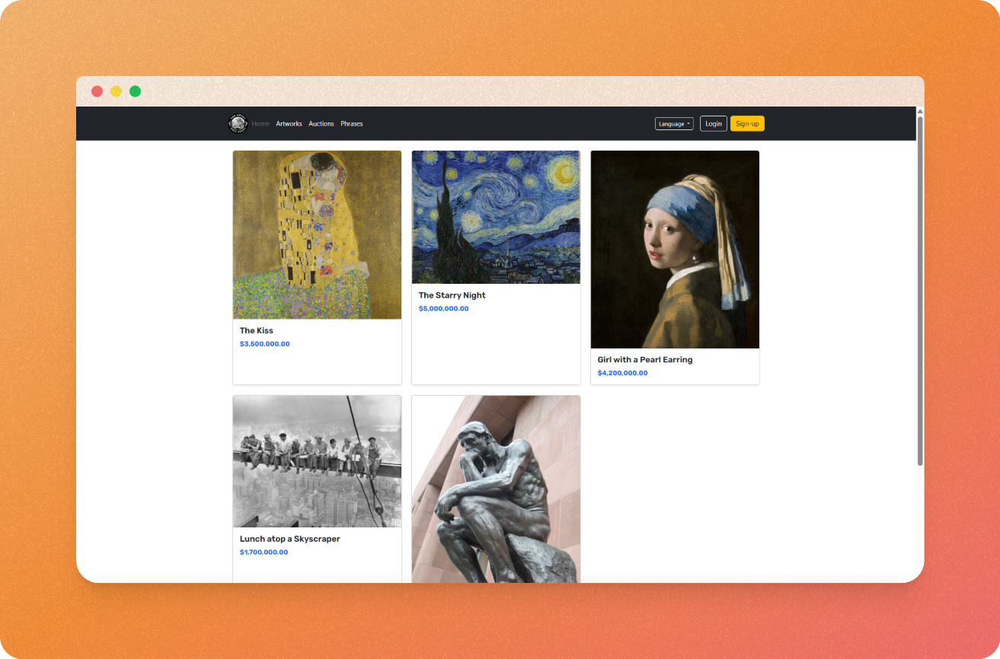
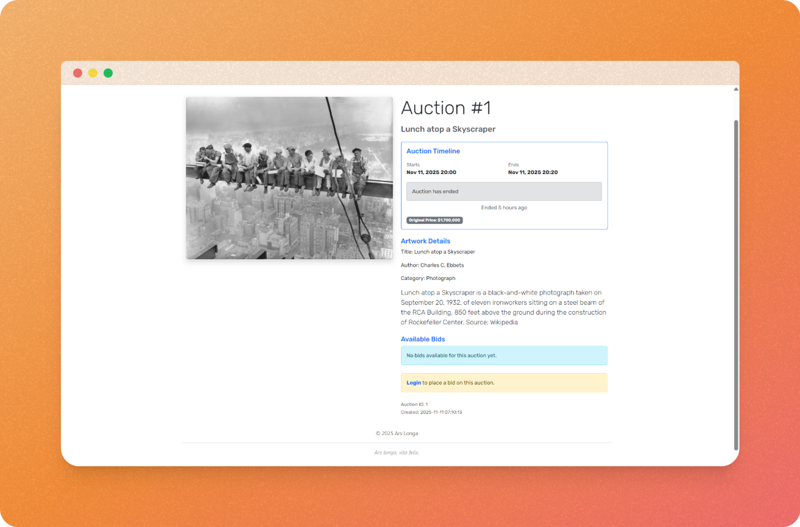
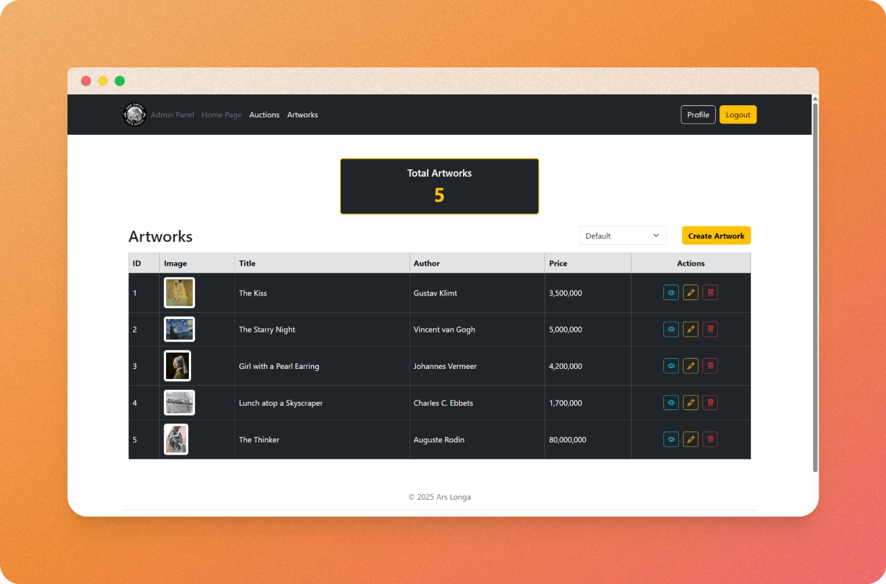
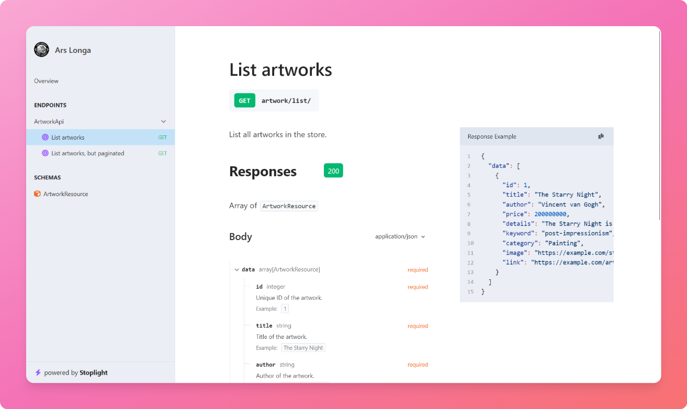

# Ars Longa

<div align="center">
    
</div>

Online art store using the Laravel PHP framework. Project for the course
“Software Architecture” (SI3001) taught by professor Daniel Correa at EAFIT
University during the 2025-2 semester.

## Screenshots







> [!TIP]
>
> Framed screenshots created using the [open-source web app Pika][pika].

[pika]: <https://github.com/rishimohan/pika#setting-up-the-app> "rishimohan/pika: Quickly design beautiful screenshots and open graph images."

## Requirements

- [PHP][php8.4] >= 8.4
- [Composer][composer] >= 2.8
- [MySQL][mysql] >= 8

[php8.4]: <https://www.php.net/releases/8.4/en.php> "PHP: A popular general-purpose scripting language that is especially suited to web development."
[composer]: <https://getcomposer.org/> "Composer: A Dependency Manager for PHP"
[mysql]: <https://www.mysql.com/> "MySQL: The world's most popular open source database"

## Production environment installation

Create a `.env.production` file (see the final section of the
[`.env.example`](.env.example)) and run Docker Compose:

```shell
docker compose --file compose.prod.yaml up --build --detach
```

## Development environment setup

### Install dependencies

```shell
composer install
```

### Setup environment

```shell

composer setup
```

> [!NOTE]
> The command above will run a custom Composer script, defined in
> `composer.json`, that will:
>  1. Create the `.env` from the `.env.example`
>  2. Create an encryption `APP_KEY`
>  3. Create an empty `database/database.sqlite` (in case we want to use sqlite)
>  4. Run migrations
>  5. Seed the database
>  6. Symlink `public/storage` to `storage/app/public`

### Customize `.env` (optional)

If you want to use MySQL, change the `DB_*` variables in `.env` with your config:

```
DB_CONNECTION=mysql
DB_HOST=127.0.0.1
DB_PORT=3306
DB_DATABASE=arslonga
DB_USERNAME=root
DB_PASSWORD=root
```

> [!WARNING]
> You must create the `DB_DATABASE` yourself. We're not automating that for you.

### Start up development server

```shell
composer dev
```

Or, if you don't want to rely on npm, or use pail, etc:

```shell
php artisan serve
```

## API

The API route is `/api/`.

You may access the `/docs/api` route to read the OpenAPI documentation
automatically generated by [Scramble][scramble].

[scramble]: <https://scramble.dedoc.co/> "Scramble – Laravel OpenAPI (Swagger) Documentation Generator"



## Authors

1. Jerónimo Acosta
2. Wendy Benítez
3. Luis Torres

## License

Copyright 2025 The Authors
